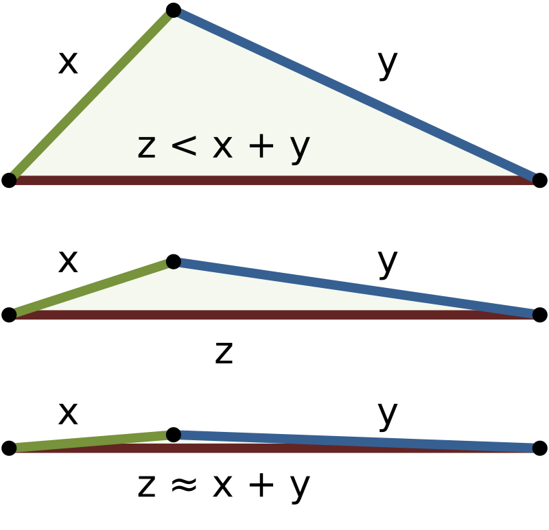
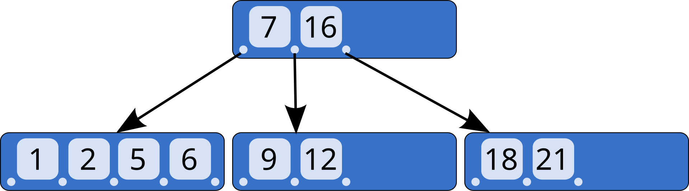
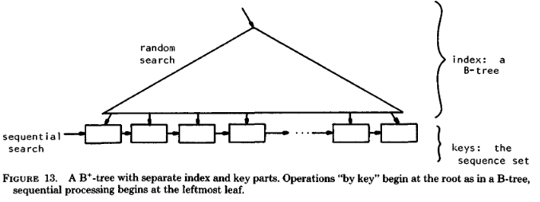

# Indexação

From: Handbook of Fingerprint Recognition - 3ed - Davide Maltoni, Dario Maio, Anil K. Jain, Jianjiang Feng

Generally, indexing refers to the use of an appropriate representation and an efficient data structure that could be useful to reduce the matching costs, returning a list of candidates against which the query sample (probe) must be matched.

- Indexing based on global features
- Indexing based on local features: Descriptors derived from local arrangements of minutiae are used instead of single minutiae because of their invariance to geometric transformation.

Cascaded filtering approach: the basic idea is to set up a sequential approach that progressively refines the search.

A recent survey of indexing approaches for biometric databases can be found in Gupta et al. (2019).

# Features de Minúcias

...

# Indexação por Árvores Métricas

## Espaço Métrico

Um espaço métrico é $\mathcal{M} = (S, d)$ com $S$ conjunto e $d: S\times S \to \mathbb{R}^+$ métrica que obedece:
- (Identidade) $d(s_i, s_i) = 0$
- (Simetria) $d(s_i, s_j) = d(s_j, s_i)$
- (Não negatividade) $0 < d(s_i, s_j) < \infty$, se $s_i \neq s_j$
- (Desigualdade Triangular) $d(s_i, s_k) \le d(s_i, s_j) + d(s_j, s_k)$



Exemplo: $\mathcal{M} = (\mathbb{R}^n, \ell^p)$ o espaço euclidiano e as normas $\ell^p$ da forma

$$\|s_i - s_j\|_p := \left(\sum_{i=1}^n|s_i(n) - s_j(n)|^p\right)^{1/p}.$$

Sendo que
- $p = 1$, Manhatann
- $p = 2$, Euclidiana
- $p = \infty$, Chebyshev

Nesse último caso,

$$\|s_i - s_j\|_\infty = \max_n\left(|s_i(n) - s_j(n)|\right)$$

## B Tree

Uma B Tree é uma estrutura de dados em árvore, auto-balanceada, que armazena dados classificados e permite pesquisas, acesso sequencial, inserções e remoções em tempo logarítmico. A árvore B é uma generalização de uma árvore de pesquisa binária em que um nó pode ter mais que dois filhos.



Operações ($O(\lg n)$)
- Busca
- Inserção (com split)
- Deleção (com reestruturação)

### B+ Tree

In a B+ tree, all keys reside in the leaves. The upper levels, which are organized as a B tree, consist only of an index, a roadmap to enable rapid location of the index and key parts.



### Bulk Loading

...

## MTree

- Todos os elementos são mantidos nos nós folha, e são replicados nos nós diretório conforme necessário;
- Cada nó tem um elemento central (chamado representante), e cada elemento do nó tem também armazenada a sua distância ao representante;
- A distância do representante ao elemento mais distante é o raio de cobertura do nó;

### Nearest Neighbors Query

1. Cria-se uma lista de vizinhos mais próximos (NN) com $k$ elementos e associada a essa NN está um valor dinâmico $d_k$ que é o *raio de busca dinâmico*. O raio de busca dinâmico $d_k$ é igual a distância de $Q$ para o elemento mais distante de NN.

    Todos elementos na NN são  iniciados com elemento nulo e distância infinita $[\_, \infty]$.

2. Os elementos que são candidatos para busca são colocados em uma priority queue (PR)

3. Uma vez que a árvore está sendo percorrida, define-se um limitante superior para distância entre $Q$ e um elemento qualquer da subárvore associada ao objeto roteador $O_r$
    $$d_\text{max}(T) = d(O_r, Q) + r(O_r)$$

    Dessa maneira, sabe-se uma maior distância temporária entre elementos.

4. Usa-se a condição:
    $$d_\text{min}(T) = \max\{d(O_r, Q) - r(O_r), 0\}$$
     
    menor distância possível entre a query e um objeto na subárvore $T$ associada a $O_r$.

    Portanto, as podas ocorrem se

    i. Não há interseção entre o raio de busca dinâmico e o raio de cobertura do roteador, $d(O_r, Q) > d_k + r(O_r)$, poda esse roteador.

    Aqui existe um Lemma para poupar cálculos, especialmente $d(O_r, Q)$.

    ii. Se a menor distância para um objeto dentro de $T$ foi ainda maior que $d_k$, $d_\text{min}(T) > d_k$, então posso podar o roteador associado a essa sub-árvore.

5. As inserções em NN ocorrem se: for um ponteiro para subárvore que garante que $d_\text{max} < d_k$ ou um elemento da raíz e $d(O_j, Q)<d_k$.

6. Para cada inserção, é preciso atualizar a lista PR removendo aqueles que $d_\text{min}(T) > d_k$.


## Slim-Tree

A Slim-tree foi a primeira estrutura métrica a cuidar da sobreposição entre nós, e esse é um de seus diferencias quanto à M-tree.

# Lib Arboretum

No nível de usuário, é preciso implementar:
- stObject, o tipo de objeto
- stMetricEvaluator, como avaliar a métrica dado o objeto

Após definido objeto e avaliador de métrica
- Page Manager (stDiskPageManager, stPlainDiskPageManager, tMemoryPageManager)
- Metric Tree
  - Add
  - NearestQuery

# Estudo de Caso: Base P

## Programa

### Execução

```
Usage: ./main <galleryPath> <queryPath>
```

Caminhos:

queryPath = .../query_basep/features/ResNet18_1013_213017/
 
galleryPath = .../gallery/features/ResNet18_1013_213017/

com flag opcional `-K` indicando o número de vizinhos retornados em cada query.

Tem um Makefile com opção `make run`.

### Engrenagens

1. Inicialização

```c++
// No main
app.Init()

void Init(){
    CreateDiskPageManager();
    CreateTree();
}

void TApp::CreateDiskPageManager()
{
   isTreeCreated = fs::exists("SlimTree.dat");
   if (isTreeCreated)
   {
      // Open existing file
      PageManager = new stPlainDiskPageManager("SlimTree.dat");
   }
   else
   {
      // Create new file
      PageManager = new stPlainDiskPageManager("SlimTree.dat", 2048);
   }
}

void TApp::CreateTree()
{
   Tree = new SlimTree(PageManager);
}
```

2. Criação da árvore

    Aqui uso o header `npy.hpp` (https://github.com/llohse/libnpy) para ler arquivos numpy.

```c++
this->galleryPath = galleryPath;
if (!isTreeCreated)
{
    LoadTree();
}
else
{
    cout << "Elements added to Tree: " << Tree->GetNumberOfObjects() << "\n\n";
}

void TApp::LoadTree()
{
    // ...
    vector<string> files = getFilesInDirectory(galleryPath);

    for (const auto &filePath : files)
    {
        // Go through the lines of matrix
         for (uint64_t i = 0; i < shape[0]; i++)
         {
        // Get ith line from data matrix
        vector<float> feature(data.begin() + i * shape[1], data.begin() + (i + 1) * shape[1]);

        id = buildId(sampleId, i);
        a = new stArray(id, feature);
        Tree->Add(a);
        delete a;
        }

        sampleId++;
    }

}
```

3. Criação da lista de queries. Isso é feito para cada amostra separadamente.

```c++
// Perform the queries
vector<string> files = getFilesInDirectory(queryPath);

for (const auto &filePath : files)
{
    LoadQueries(filePath);
    if (queryObjects.size() > 0)
        PerformQueries();
}

void TApp::LoadQueries(string queryFile)
{
    //...

    // clear before using.
    queryObjects.clear();

    npy::npy_data<float> d = npy::read_npy<float>(queryFile);

    // Go through the lines of matrix
   for (uint64_t i = 0; i < shape[0]; i++)
   {
      // Get ith line from data matrix
      vector<float> feature(data.begin() + i * shape[1], data.begin() + (i + 1) * shape[1]);

      // Insert feature vector in the queryObjects vector
      this->queryObjects.insert(queryObjects.end(), new stArray(i, feature));
   }
}
```

4. Realizar KNN query. No final os resultados são ranqueados baseados no score.
    - Cada indivíduo $j$ tem uma lista de matches associada $\mathbf{v}_j$
    $$s = \frac{n^{3/4}}{\langle\mathbf{v}_j\rangle + .15}$$

```c++
void TApp::PerformQueries()
{
    ResultDict map;

    map = PerformNearestQuery();

    // Sort map by score and outputs list of 8 highest scores
    
}

ResultDict TApp::PerformNearestQuery()
{
   ResultDict map; // maps SampleId -> vector<(FeatureId, Distance)>

   unsigned long size = queryObjects.size();

    //...
      for (unsigned int i = 0; i < size; i++)
      {
         result = Tree->NearestQuery(queryObjects[i], K);

         for (unsigned int j = 0; j < result->GetNumOfEntries(); j++)
         {
            //...
            map[getSampleId(id)].push_back(KthElemenResult (id, dist));
         }
      } // end for
   }

   return map;
}

```

## Construção da árvore

```
Athena:
Total Time: 178.608s. Added 677439 objects to tree

SlimTree.dat size: ~1.5G
```

## Performance das Queries

### Tempo

Dummy Tree
Query de uma feature na árvore cheia
- 3.2s, K=64

Slim Tree

Query de uma feature na árvore cheia
- 4.4s, K=1
- 5s, K=8
- 4.7s, K=64

Acessos a disco
- 34960, 5s, K=64
- 13588, 4.6s
- 23320, 4.5s
- 16407, 4.4s

Cálculos de distância
- 64466, 5s, K=64
- 25058, 4.6s
- 42996, 4.5s
- 30242, 4.4s

### Acerto

Success Rate: 90.36%, Considerando somente rank3

Success Rate: 92.14%, Considerando rank3 e vizinhos de -5 até +5.

# TO DO

- Ver desempenho, velocidade (Willian)
- Novas bases (André)
- Medir velocidades de cálculo de distância
- Distância cosseno
- Reportar ranking 100

Não prioridades
- Após uma busca completa das M features com K vizinhos, 100%?
- Árvore só com índices
- Score