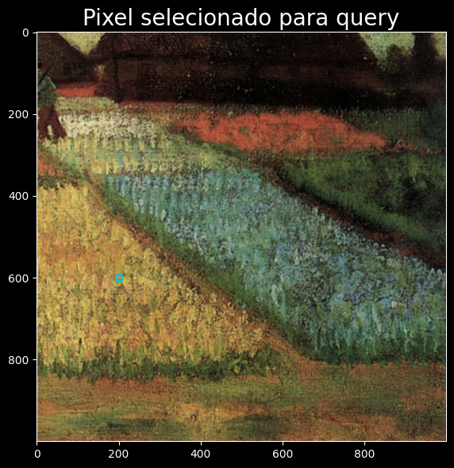
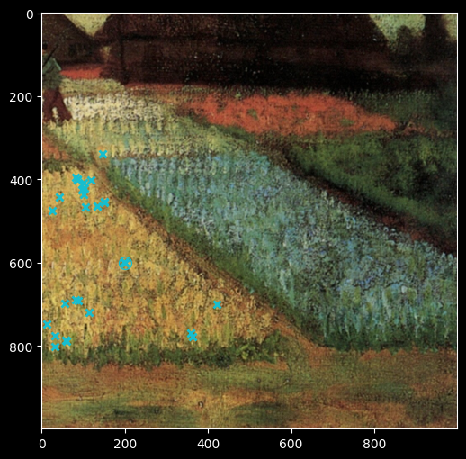
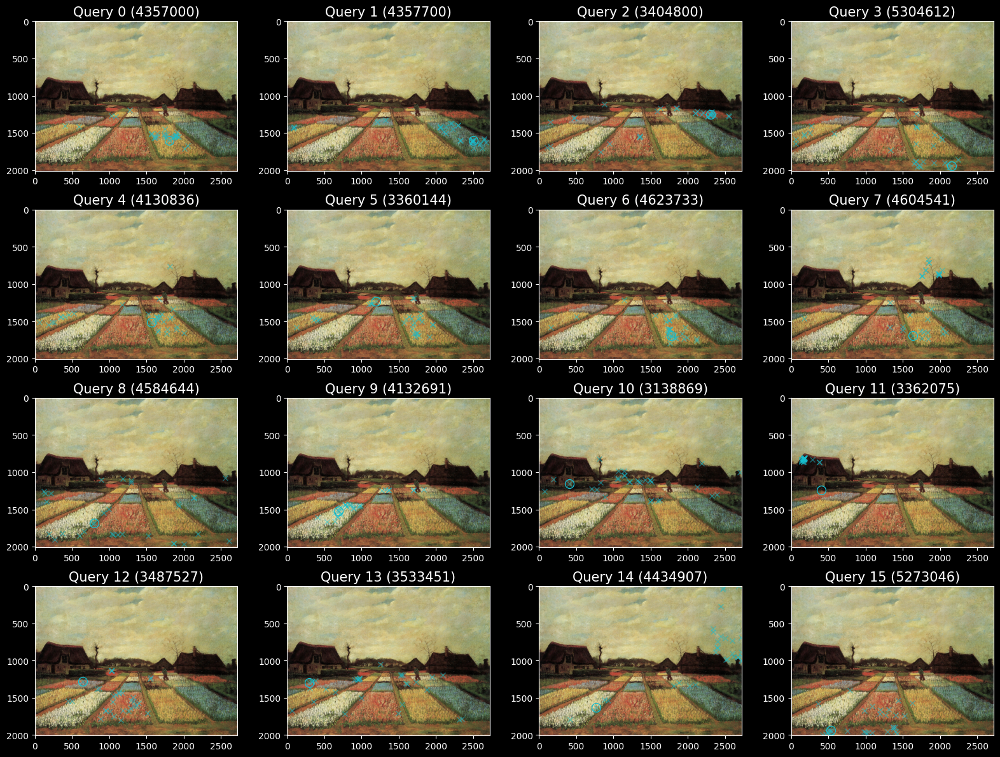
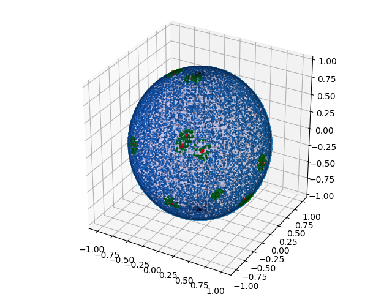

# Busca VanGogh

## Busca Sequencial: Recorte 1000x1000

Selecionando pixel/vetor $(r, g, b)$ (float32) para realizar uma query no quadro recortado (1000x1000 = 1e6 pixels)



- Dados

```python
IMAGEM = array([[0.13725491, 0.08627451, 0.0627451 ],
        [0.2       , 0.14901961, 0.1254902 ],
        [0.16470589, 0.1254902 , 0.09019608],
        ...,
        [0.3019608 , 0.16862746, 0.12941177],
        [0.2901961 , 0.16470589, 0.12156863],
        [0.27058825, 0.14117648, 0.10588235]], dtype=float32)

IMAGEM.shape #> (1000000, 3)

QUERY = array([0.72156864, 0.654902  , 0.33333334], dtype=float32) # pixel (200, 600)
```

- Função de busca knn
 
```python
def L2(query, features):
    # Compute L2 distance between query and features
    return np.sqrt(np.sum((query - features)**2, axis=1))

def knn(k, query, features):
    # Busca knn sequencial
    ...
    distances = L2(query, features)
    for i in range(k):
        min_idx = np.argmin(distances)
```

- Resultados

```
Knn for k=32
Median time: 70.345 ms (mediana de várias queries com mesmo vetor)
```



Lista dos pixels:

[421104, 425096, 600200, 690082, 789059, 436101, 443043, 720114, 464134, 475025, 692089, 775032, 779364, 787058, 396081, 456150, 465134, 599198, 600201, 698055, 701421, 747012, 803032, 424098, 453150, 770359, 339147, 400086, 401086, 401118, 408102, 466106]

## Busca Sequencial: Imagem Inteira 2722x2009

Bulb Fields

Flower Beds in Holland


- Dados

Imagem completa tem tamanho 2722x2009 = 5.468.498

```
Queries Array Shape:  (16, 3)
Features (Flat Image) Shape:  (5468498, 3)
```

- Busca

Continua sendo sequencial knn

- Resultados

```
Knn for k=32
Median time: 434.344 ms (mediana de várias queries diferentes)
```



## Busca MTree Python

Foi selecionado trecho 200x200 (40.000)

- Montar a árvore

Para montar a árvore: 140s, 3.170.160 cálculos de distância

- Comparação

Busca Sequencial: Median time: 3.000 ms de uma só query na árvore

[15402, 19724, 20100, 20107, 21338, 22098, 24557, 26063, 26269, 13708, 13720, 17518, 18034, 19097, 20475, 21906, 22524, 23291, 24797, 25189, 25664, 26081, 12272, 13722, 16696, 16700, 16701, 17502, 19098, 19297, 19728, 19931]

Busca na árvore: Median time: Count: 6093, Time: 955.250ms de uma só query

1. Demora demais
2. O número de cálculos de distância não é consistente (varia de chamada para chamada)
3. No entanto, o númerod e cálculo de distância é significativamente maior

[15402, 19724, 20107, 21338, 20100, 24557, 22098, 26063, 26269, 13720, 18034, 13708, 17518, 23291, 24797, 21906, 19097, 25189, 25664, 26081, 22524, 20475, 17502, 16696, 16701, 12272, 16700, 13722, 21400, 23323, 22099]

## Busca na Arboretum

### Imagem 1000x1000:

1. DummyTree (sequencial)

Usando página: 512*1024 (quanto maior número de página, mais rápido)

```
Loading data with shape: 1000000x3
99% completedTotal Time: 149.054s.
Added 1000000 objects to tree (1000000)

Height of Tree: 0
Node count: 54
Min/Max node occupation: -1/18724

Loading query objects with shape: 1x3
Added 1 query objects

Performing 1 queries with DummyTree
Single Query Time: 221.164(mili second)
k = 32
(425096, 0.0000) (421104, 0.0000) (600200, 0.0000) (690082, 0.0000) (789059, 0.0000) (443043, 0.0039) (436101, 0.0039) (720114, 0.0039) 
(464134, 0.0055) (475025, 0.0055) (692089, 0.0055) (779364, 0.0055) (775032, 0.0055) (787058, 0.0055) (396081, 0.0068) (465134, 0.0068) 
(456150, 0.0068) (600201, 0.0068) (599198, 0.0068) (701421, 0.0068) (698055, 0.0068) (747012, 0.0068) (803032, 0.0068) (424098, 0.0078) 
(453150, 0.0078) (770359, 0.0078) (339147, 0.0088) (408102, 0.0088) (401118, 0.0088) (401086, 0.0088) (400086, 0.0088) (466106, 0.0088) 


Total Time: 221.2(mili second)
Avg Disk Accesses: 54
Avg Distance Calculations: 1000000
```

2. SlimTree

Usando página: 1024, com resultado indo de 8ms até 18ms (parece um cold start, pq depois de repetir sempre fica mais rápido)

```
Loading data with shape: 1000000x3
99% completedTotal Time: 28.2113s.
Added 1000000 objects to tree (1000000)

Height of Tree: 5
Node count: 60974
Min/Max node occupation: 0.25/28

Loading query objects with shape: 1x3
Added 1 query objects

Performing 1 queries with SlimTree
Single Query Time: 8.945(mili second)
k = 32
(425096, 0.0000) (421104, 0.0000) (789059, 0.0000) (690082, 0.0000) (600200, 0.0000) (443043, 0.0039) (436101, 0.0039) (720114, 0.0039) 
(775032, 0.0055) (464134, 0.0055) (692089, 0.0055) (779364, 0.0055) (475025, 0.0055) (787058, 0.0055) (701421, 0.0068) (465134, 0.0068) 
(456150, 0.0068) (396081, 0.0068) (600201, 0.0068) (599198, 0.0068) (698055, 0.0068) (747012, 0.0068) (803032, 0.0068) (770359, 0.0078) 
(424098, 0.0078) (453150, 0.0078) (775424, 0.0088) (485024, 0.0088) (466106, 0.0088) (408102, 0.0088) (400086, 0.0088) (339147, 0.0088) 


Total Time: 8.987(mili second)
Avg Disk Accesses: 3545
Avg Distance Calculations: 19747
```

Usando página: 1024*8, parece que fica muito mais rápido, mesmo fazendo muitos outros cálculos de distância. Cerca de 2ms

```
Loading data with shape: 1000000x3
99% completedTotal Time: 59.6134s.
Added 1000000 objects to tree (1000000)

Height of Tree: 3
Node count: 5413
Min/Max node occupation: 0.25/227

Loading query objects with shape: 1x3
Added 1 query objects

Performing 1 queries with SlimTree
Single Query Time: 3.13(mili second)
k = 32
(690082, 0.0000) (789059, 0.0000) (421104, 0.0000) (600200, 0.0000) (425096, 0.0000) (720114, 0.0039) (436101, 0.0039) (443043, 0.0039) 
(775032, 0.0055) (779364, 0.0055) (787058, 0.0055) (692089, 0.0055) (464134, 0.0055) (475025, 0.0055) (747012, 0.0068) (803032, 0.0068) 
(698055, 0.0068) (600201, 0.0068) (396081, 0.0068) (465134, 0.0068) (701421, 0.0068) (599198, 0.0068) (456150, 0.0068) (424098, 0.0078) 
(770359, 0.0078) (453150, 0.0078) (339147, 0.0088) (485024, 0.0088) (775424, 0.0088) (719114, 0.0088) (408102, 0.0088) (401118, 0.0088) 
Single Query Time: 3.028(mili second)
Single Query Time: 2.94(mili second)
Single Query Time: 2.92(mili second)
Single Query Time: 2.919(mili second)
Single Query Time: 2.929(mili second)
Single Query Time: 2.916(mili second)
Single Query Time: 2.918(mili second)
Single Query Time: 2.914(mili second)
Single Query Time: 2.912(mili second)


Total Time: 29.7(mili second)
Avg Disk Accesses: 2060
Avg Distance Calculations: 120980
```

### Imagem 2009x2722

1. DummyTree

Tamanho da página 2048 * 4

```
Loading data with shape: 5468498x3
99% completedTotal Time: 24.2212s.
Added 5468498 objects to tree (5468498)

Height of Tree: 0
Node count: 18728
Min/Max node occupation: -1/292

Loading query objects with shape: 16x3
Added 16 query objects

Performing 16 queries with DummyTree
Single Query Time: 1192.44(mili second)
k = 32
(3940478, 0.0000) (4111864, 0.0000) (4111784, 0.0000) (4130841, 0.0000) (4177446, 0.0000) (4185449, 0.0000) (4215585, 0.0000) (4217992, 0.0000) 
(4231902, 0.0000) (4253625, 0.0000) (4258810, 0.0000) (4321614, 0.0000) (4357000, 0.0000) (4558678, 0.0000) (4659350, 0.0000) (3248616, 0.0039) 
(3449797, 0.0039) (3487967, 0.0039) (3830253, 0.0039) (3857665, 0.0039) (4052242, 0.0039) (4128284, 0.0039) (4128322, 0.0039) (4155665, 0.0039) 
(4188331, 0.0039) (4193767, 0.0039) (4220739, 0.0039) (4231865, 0.0039) (4234587, 0.0039) (4242616, 0.0039) (4266993, 0.0039) (4275396, 0.0039) 
Single Query Time: 1209(mili second)
Single Query Time: 1208(mili second)
Single Query Time: 1260(mili second)
Single Query Time: 1207(mili second)
Single Query Time: 1210(mili second)
Single Query Time: 1217(mili second)
Single Query Time: 1192(mili second)
Single Query Time: 1191(mili second)
Single Query Time: 1246(mili second)
Single Query Time: 1220(mili second)
Single Query Time: 1193(mili second)
Single Query Time: 1192(mili second)
Single Query Time: 1221(mili second)
Single Query Time: 1194(mili second)
Single Query Time: 1204(mili second)


Total Time: 1.936e+04(mili second)
Avg Disk Accesses: 1.873e+04
Avg Distance Calculations: 5468498
```

2. SlimTree

Tamanho da página 2048*4

```
Loading data with shape: 5468498x3
99% completedTotal Time: 372.989s.
Added 5468498 objects to tree (5468498)

Height of Tree: 4
Node count: 29006
Min/Max node occupation: 0.25/227

Loading query objects with shape: 16x3
Added 16 query objects

Performing 16 queries with SlimTree
Single Query Time: 21.35(mili second)
k = 32
(4659350, 0.0000) (4357000, 0.0000) (4130841, 0.0000) (4111864, 0.0000) (4111784, 0.0000) (4231902, 0.0000) (4321614, 0.0000) (4253625, 0.0000) 
(4258810, 0.0000) (4558678, 0.0000) (3940478, 0.0000) (4185449, 0.0000) (4215585, 0.0000) (4177446, 0.0000) (4217992, 0.0000) (3830253, 0.0039) 
(3487967, 0.0039) (4242616, 0.0039) (4231865, 0.0039) (4155665, 0.0039) (3449797, 0.0039) (4675669, 0.0039) (4310760, 0.0039) (4052242, 0.0039) 
(4266993, 0.0039) (4501330, 0.0039) (4425119, 0.0039) (4220739, 0.0039) (4234587, 0.0039) (4193767, 0.0039) (4188331, 0.0039) (3857665, 0.0039) 
Single Query Time: 9.201(mili second)
Single Query Time: 14.53(mili second)
Single Query Time: 26.35(mili second)
Single Query Time: 13.7(mili second)
Single Query Time: 11.85(mili second)
Single Query Time: 17.83(mili second)
Single Query Time: 14.71(mili second)
Single Query Time: 16.09(mili second)
Single Query Time: 3.896(mili second)
Single Query Time: 8.468(mili second)
Single Query Time: 3.634(mili second)
Single Query Time: 10.17(mili second)
Single Query Time: 9.075(mili second)
Single Query Time: 10.92(mili second)
Single Query Time: 11.74(mili second)


Total Time: 203.9(mili second)
Avg Disk Accesses: 1067
Avg Distance Calculations: 30666
```

## Conclusão

Considerando k = 32

||Sequencial Python (1e6)|Sequencial Python (5.46e6)|Sequencial Python (40k)|MTree Python (40k)|
|:-:|:-:|:-:|:-:|:-:|
|Single Query|70.345 ms|434 ms|3 ms|955ms|
|# Distâncias|-|-|-|6093|

||DummyTree (1e6)|SlimTree/1024 (1e6)|SlimTree/1024*8 (1e6)|DummyTree (5.46e6)|SlimTree (5.46e6)|
|:-:|:-:|:-:|:-:|:-:|:-:|
|Single Query|221ms ms|8 ms|3 ms|1221 ms|10.17 ms (3.6 ms*)|
|# Distâncias|-|3545|120980|-|30666|

Obsevações:
- A notação SlimTree/1024 indica que o tamanho da página da SlimTree era 1024
- Isso causa grande impacto no desempenho alterando parâmetros importantes como altura da árvore, número de cálculos de distância e número de acessos ao disco
- Inclusive o número de acessos ao disco pode ser uma das causas (não sei como é a implementação)
- \* Melhor caso

# Busca vetores unitários aleatórios

Como se comporta essa busca em vetores unitários aleatórios?

- Será que a dimensão importa?
- Será que a distância cosseno traz resultados diferentes da distância euclidiana?

## Caso 3-D

- 10k pontos, distribuídos na esfera
  - k = 32
  - Mediana de 1ms por query
    

- 100k pontos
  - 80 queries, Total 524 ms
  - Median 6 ms/query

- 1M pontos
  - 80 queries, Total 5083 ms
  - Median 58 ms/query

## Caso N-D

Considerando 100k amostras

### Python Sequencial

|Resultados\Dimensão|128|64|32|16|8|4|
|:-:|:-:|:-:|:-:|:-:|:-:|:-:|
|1 query* (ms)|76|37|21|13|8.1|6.7|
|80 queries (ms)|7044|3378|1943|1123|715|570|

\* Mediana

### Aboretum

Saída bruta: [nd_unit.txt](nd_unit.txt)

- DummyTree

Com páginas de tamanho: 2048*4

|Resultados\Dimensão|128|64|32|16|8|4|
|:-:|:-:|:-:|:-:|:-:|:-:|:-:|
|1 query* (ms)|413|216|123|69|41|24|
|80 queries (ms)|33280|17800|10270|5900|3327|2112|
|# disk acc |6667|3334|1786|981|589|393|
|# dist |-\*|-|-|-|-|-|

\* Igual ao número de elementos (100000)

- SlimTree

Com páginas de tamanho: 1024*8

|Resultados\Dimensão|128|64|32|16|8|4|
|:-:|:-:|:-:|:-:|:-:|:-:|:-:|
|1 query* (ms)|462|233|116|62|24|2.5|
|80 queries (ms)|37420|18840|9388|5076|1939|192|
|# disk acc |11k|4280|2103|1131|612|128|
|# dist |100910|100186|100056|98631|62004|8399|

Com outros tamanhos de página, não consegui nada muito diferente.

Observação: Quando o número de acessos de disco cai, o número de cálculos de distância sobe em média.

Observação 2: Existem duas coisas interconectadas quando analisamos o número de acessos a disco e o número de cálculos de distância. O número de cálculos de distância permanece mais ou menos fixo, isso pode ser pela degradação da SlimTree para alta dimensionalidade.

## Distância Cosseno

A distância cosseno não é uma métrica uma vez que não obedece a desigualdade triangular. De qualquer maneira, quando usei a distância cosseno, os resultados da busca foram os mesmos.

Comparando sua performance ([cosdist.txt](cosdist.txt))

|Resultados\Dimensão|128|64|32|16|8|4|
|:-:|:-:|:-:|:-:|:-:|:-:|:-:|
|1 query* (ms)|420|220|110|33|7|0.6|
|80 queries (ms)|33426|17969|9100|2791|574|59|
|# disk acc |418|437|234|243|207|78|
|# dist |100007|99902|93904|57419|16612|1629|

# Outras estruturas

https://github.com/erikbern/ann-benchmarks

- KDTree (Python)

|Resultados\Dimensão|128|64|32|16|8|4|
|:-:|:-:|:-:|:-:|:-:|:-:|:-:|
|80 queries (ms)|4021|2467|1500|951|117|5|

- Annoy (C++/Python)

https://calmcode.io/course/annoy/how-it-works-1

Para `n_trees=500`

|Resultados\Dimensão|128|64|32|16|8|4|
|:-:|:-:|:-:|:-:|:-:|:-:|:-:|
|80 queries (ms)|485|427|429|475|486|463|

\* Aproximado. Qualidade depende do número de árvores.

- MVP Tree

DISTANCE-BASED INDEXING FOR HIGH-DIMENSIONAL METRIC SPACES

- iDistance

On the theory and practice of high-dimensional data indexing with iDistance

iDistance: An Adaptive B+-tree Based Indexing Method for Nearest Neighbor Search

https://code.google.com/archive/p/idistance/

https://www.ruizhang.info/code.htm

- XTree