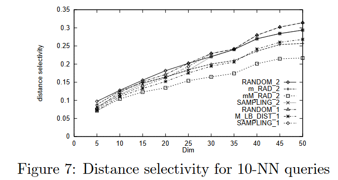
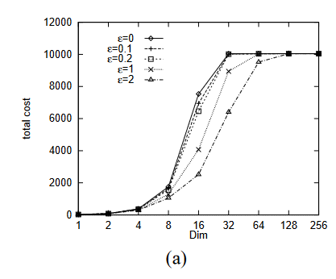
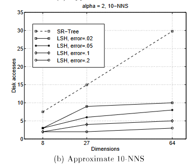
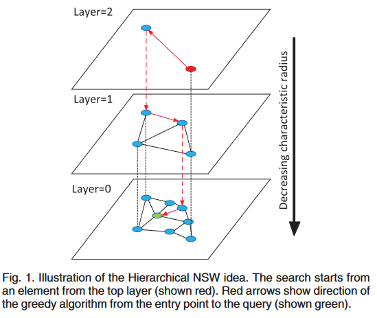

# B-Tree

# Generalized Search Tree (GiST)

http://gist.cs.berkeley.edu/

# R-Tree, R$^+$-Tree, R$^\ast$-Tree

To Do

# VP-Tree

To Do

# M-Tree

To Do

## M-tree: An Efficient Access Method for Similarity Search in Metric Spaces

> A new access method, called M-tree, is proposed to organize and search large data sets from a generic “metric space”, i.e. where object proximity is only defined by a distance function satisfying the positivity, symmetry, and triangle inequality postulates. We detail algorithms for insertion of objects and split management, which keep the M-tree always balanced - several heuristic split alternatives are considered and experimentally evaluated. Algorithms for similarity (range and k-nearest neighbors) queries are also described. Results from extensive experimentation with a prototype system are reported, considering as the performance criteria the number of page I/O’s and the number of distance computations. The results demonstrate that the Mtree indeed extends the domain of applicability beyond the traditional vector spaces, performs reasonably well in high-dimensional data spaces, and scales well in case of growing files.

### Introduction

- Similarity queries in multimedia
- Spatial Access Methods (SAMs), such as R-tree [Gut84] and its variants [SRF87, BKSS90], have been considered to index such data. However, the applicability of SAMs is limited by the following assumptions which such structures rely on:
    1. objects are, for indexing purposes, to be represented by means of feature values in a multidimensional vector space;
- development of  metric trees (see [Uhl91])
- implementation using GiST (Generalized Search Tree) framework, http://www-db.disi.unibo.it/Mtree/

### Concepts

- Metric space $\mathcal{M} = (\mathcal{D}, d)$. For $x, y, z \in \mathcal{D}$
  1. $d(x, y) = d(y,x)$ (symmetry)
  2. $d(x, y) > 0$, if $x\neq y$ e $d(x, x) = 0$ (non negativity)
  3. $d(x, y) \le d(x, z) + d(z, y)$ (traingle inequality)
- Query types
    1. (**Range**) Given a query object $Q \in \mathcal{D}$ and a maximum search distance $r(Q)$, the range query $\texttt{range}(Q, r(Q))$ selects all indexed objects $O_j$ such that $d(O_j , Q) ≤ r(Q)$.
    2. (**k nearest neighbors**) Given a query object $Q ∈ D$ and an integer $k ≥ 1$, the k-NN query $\texttt{NN}(Q, k)$ selects the $k$ indexed objects which have the shortest distance from $Q$.

### Structure

- To Do

### Results

- Data sets were obtained by using the procedure described in [JD88] which generates normally distributed clusters in a Dim-$D$ vector space.
  - The discrepancy between my results and those reported in the paper might be due to differences in data distribution.



### Cite

```bibtex
@inproceedings{ciaccia1997m,
  title={M-tree: An efficient access method for similarity search in metric spaces},
  author={Ciaccia, Paolo and Patella, Marco and Zezula, Pavel and others},
  organization={Citeseer}
}
```

## Tasting the Time: How M-Tree Broke the “27 Club” Curse

> The M-tree turned 27 this year, since it was first published in 1997, at SEBD  and VLDB . Differently from the likes of Jim Morrison, Jimi Hendrix, and Amy Winehouse, it is still alive and kicking, receiving dozens of downloads and citations every year.1 In this paper, we offer a quick overview of the context in which the M-tree was created and show how it helped starting a whole family of metric trees.

### Content

- Even without any notion of objects’ coordinates (as used by spatial indices), a metric index can effectively prune part of the search space by exploiting above properties [metric spaces], in particular the triangle inequality.
- Although at that time some proposals of metric indices were already available, such as the VP-tree [ 3 ] and the GNATree [ 4 ], they were based on a main-memory implementation, thus unsuitable for large, disk-resident datasets, the common case for multimedia data. The 2nd ingredient/requirement for the design of the M-tree was therefore to devise a paged and balanced organization, along the successful lines adopted by B+-trees and R-trees.

---

- Since its first introduction, in 1997 at SEBD [ 5 ] and VLDB [ 6 ], M-tree has been extended with: an efficient bulk loading technique ; cost models for estimating search costs  and ; techniques for evaluating complex queries, where multiple similarity predicates are
defined on a single feature  or on multiple features (M2-tree) ; efficient algorithms for solving probably approximately correct (PAC) queries [ 11]
and ; a technique to correctly solve queries using a user-defined distance, different from the
one used to build the actual index (QIC-M-tree) .
- The two original papers were seminal in generating a whole family of metric access methods, sharing the general M-tree structure. Besides the already cited M2-tree and QIC-M-tree, several techniques have been proposed to improve the search performance of M-tree, among which the slim-tree [ 15], the PM-tree [ 16], the M+-tree [ 17 ], the BM+-tree [ 18 ], and the M∗-tree [ 19 ]. Finally, the NM-tree [ 20] is able to deal with distance functions that do not satisfy the metric postulates, in particular the triangle inequality.

### Cite

```bibtex
@article{ciaccia2024tasting,
  title={Tasting the Time: How M-Tree Broke the “27 Club” Curse},
  author={Ciaccia, Paolo and Patella, Marco and Rabitti, Fausto and Zezula, Pavel},
  year={2024}
}
```

# Curse of Dimensionality

## Adaptive Control Processes

To Do, Bellman

## When Is “Nearest Neighbor” Meaningful?

> We explore the effect of dimensionality on the “nearest neighbor” problem. We show that under a broad set of conditions (much broader than independent and identically distributed dimensions), as dimensionality increases, the distance to the nearest data point approaches the distance to the farthest data point. To provide a practical perspective, we present empirical results on both real and synthetic data sets that demonstrate that this effect can occur for as few as 10-15 dimensions.
>
> These results should not be interpreted to mean that high-dimensional indexing is never meaningful; we illustrate this point by identifying some high-dimensional workloads for which this effect does not occur. However, our results do emphasize that the methodology used almost universally in the database literature to evaluate high-dimensional indexing techniques is flawed, and should be modified. In particular, most such techniques proposed in the literature are not evaluated versus simple linear scan, and are evaluated over workloads for which nearest neighbor is not meaningful. Often, even the reported experiments, when analyzed carefully, show that linear scan would outperform the techniques being proposed on the workloads studied in high (10-15) dimensionality!

### Introduction

- We show that under certain broad conditions (in terms of data and query distributions, or workload), as dimensionality increases, the distance to the nearest neighbor approaches the distance to the farthest neighbor
- To provide a practical perspective, we present empirical results based on synthetic distributions showing that the distinction between nearest and farthest neighbors may blur with as few as 15 dimensions.
- We observe that the database literature on nearest neighbor processing techniques fails to compare new techniques to linear scans.

### Concepts

- Proves a theorem that shows that if
  $$\lim_{m\to \infty}\text{var}\left(\frac{(d_m(P_m, Q_m))^p}{\mathbb{E}[(d_m(P_m, Q_m))^p]}\right) = 0$$
  in other words, the variance of the distance distribution scaled by the overall magnitude of the distance converges to 0
  
  Then for every $\epsilon > 0$ 
  $$\lim_{m\to \infty} P[D_\text{max} \le (1+\varepsilon) D_\text{min}] = 1$$
  where $D_\text{max}$ and $D_\text{min}$ are the distances to the farthest and nearest neighbors, respectively.
- In these cases, if the rate at which the distances become meaningless is faster enough, than the concept of nearest neighbor at that particular dimensionality is meaningless.
- There are, however, some workloads for which the nearest neighbor concept is meaningful even in high-dimensional spaces depending on the data distribution.

### Cite

```bibtex
@inproceedings{beyer1999nearest,
  title={When is “nearest neighbor” meaningful?},
  author={Beyer, Kevin and Goldstein, Jonathan and Ramakrishnan, Raghu and Shaft, Uri},
  booktitle={Database Theory—ICDT’99: 7th International Conference Jerusalem, Israel, January 10--12, 1999 Proceedings 7},
  pages={217--235},
  year={1999},
  organization={Springer}
}
```

## A Quantitative Analysis and Performance Study for Similarity-Search Methods in High-Dimensional Spaces

> For similarity search in high-dimensional vector spaces (or ‘HDVSs’), researchers have proposed a number of new methods (or adaptations of existing methods) based, in the main, on data-space partitioning. However, the performance of these methods generally degrades as dimensionality increases. Although this phenomenon-known as the ‘dimensional curse’-is well known, little or no quantitative a.nalysis of the phenomenon is available. In this paper, we provide a detailed analysis of partitioning and clustering techniques for similarity search in HDVSs. We show formally that these methods exhibit linear complexity at high dimensionality, and that existing methods are outperformed on average by a simple sequential scan if the number of dimensions exceeds around 10. Consequently, we come up with an alternative organization based on approximations to make the unavoidable sequential scan as fast as possible. We describe a simple vector approximation scheme, called VA-file, and report on an experimental evaluation of this and of two tree-based index methods (an R*-tree and an X-tree).

### Introduction

- We establish lower bounds on the average performance of existing partitioning and clustering techniques. We demonstrate that these methods are outperformed by a sequential scan whenever the dimensionality is above 10.
- By establishing a general model for clustering and partitioning, we formally show that there is no organization of HDVS based on clustering or partitioning which does not degenerate to a sequential scan if dimensionality exceeds a certain threshold
- We present performance results which support our analysis, and demonstrate that the performance of a simple, approximation-based scheme called vector approximation file (or ‘VA-file’) offers the best, performance in practice whenever the number of dimensions is larger than around 6. The VA-File is the only method which we have studied for which performance can even improve as dimensionality increases.

### Concepts

- Let $Q$ be ther query point and $\mathcal{S}^d(r, Q)$ be the hypersphere centered at $Q$ with radius $r$ and dimension $d$. Considering uniformity and independence of the data points, given any point $P$, the probability that $\mathcal{S}^d(r, Q)$ contains $P$ is equal to the volume of that part of $\mathcal{S}^d(r, Q)$  which lies inside the data space.
  $$\int_{P\in \Omega} \left(\begin{cases}1,\quad \|Q - P\|_2 \le r \\ 0, \quad \text{otherwise}\end{cases}\right)\ dP$$
- For the case, where $\Omega = [0, 1]^d$ the largest hypersphere that can be inscribed in the unit cube is the $\mathcal{S}^d\left(\frac{1}{2}, Q\right)$, the probability that a point $P$ is inside this hypersphere is
  $$\frac{\text{Vol}(\mathcal{S}^d(1/2, Q))}{\text{Vol}(\Omega)} = \frac{\sqrt{\pi^d} \cdot (1/2)^d}{\Gamma (d/2 + 1)}$$
  the table below shows the probability that a point is inside the hypersphere and the number of data points needed in the database, such that on average, one of them is inside the hypersphere.

  |d |$\mathbb{P}$ |$N$|
  |:-:|:-:|:-:|
  |$2$    |$0.785$ |$1.273$|
  |$4$    |$0.308$ |$3.242$|
  |$10$   |$0.002$ |$401.5$|
  |$20$   |$2.461\cdot10^{-8}$ |$40.631.627$|
  |$40$   |$3.278\cdot10^{-21}$| $3.050\cdot 10^{20}$|
  |$100$  |$1.868\cdot10^{70}$ |$5.353\cdot 10^{69}$|

- To Do, muitas outras coisas

### Method

- To Do, VA FILE

### Results

- We now show that no partitioning or clustering scheme can offer efficient NN-search if the number of dimensions becomes large.

1. Conclusion 1 (Performance) For any clustering and partitioning method there is a dimensionality $d^\ast$ beyond which a simple sequential scan performs better.
2. Conclusion 2 (Complexity) The complexity of any clustering and partitioning methods tends towards $O(N)$ as dimensionality increases.
3. Conclusion 3 (Degeneration) For every partitioning and clustering method there is a dimensionality $d^\ast$ such that, on average, all blocks are accessed if the number of dimensions exceeds $d^\ast$.

### Cite

```bibtex
@inproceedings{weber1998quantitative,
  title={A quantitative analysis and performance study for similarity-search methods in high-dimensional spaces},
  author={Weber, Roger and Schek, Hans-J{\"o}rg and Blott, Stephen},
  booktitle={VLDB},
  volume={98},
  pages={194--205},
  year={1998}
}
```

## Fractal Dimensionality

- To Do, important for the understanding of the concept of dimensionality

# SR-Tree

## The SR-tree: An Index Structure for High-Dimensional Nearest Neighbor Queries

> Recently, similarity queries on feature vectors have been widely used to perform content-based retrieval of images. To apply this technique to large databases, it is required to develop multidimensional index structures supporting nearest neighbor queries efficiently. The SS-tree had been proposed for this purpose and is known to outperform other index structures such as the R*-tree and the K-D-B-tree. One of its most important features is that it employs bounding spheres rather than bounding rectangles for the shape of regions. However, we demonstrate in this paper that bounding spheres occupy much larger volume than bounding rectangles with high-dimensional data and that this reduces search efficiency. To overcome this drawback, we propose a new index structure called the SR-tree (Sphere/Rectangle-tree) which integrates bounding spheres and bounding rectangles. A region of the SR-tree is specified by the intersection of a bounding sphere and a bounding rectangle. Incorporating bounding rectangles permits neighborhoods to be partitioned into smaller regions than the SS-tree and improves the disjointness among regions. This enhances the performance on nearest neighbor queries especially for highdimensional and non-uniform data which can be practical in actual image/video similarity indexing. M’e include the performance test results that verify this advantage of the SR-tree and show that the SR-tree outperforms both the SS-tree and the R*-tree.

### Cite

```bibtex
@article{katayama1997sr,
  title={The SR-tree: An index structure for high-dimensional nearest neighbor queries},
  author={Katayama, Norio and Satoh, Shin'ichi},
  journal={ACM Sigmod Record},
  volume={26},
  number={2},
  pages={369--380},
  year={1997},
  publisher={ACM New York, NY, USA}
}
```

# PAC Nearest Neighbor Queries

## PAC Nearest Neighbor Queries: Approximate and Controlled Search in High-Dimensional and Metric Spaces

> In high-dimensional and complex metric spaces, determinng the nearest neighbor (NN) of a query object $q$ can be a very expensive task, because of the poor partitioning operated by index structures – the so-called “curse of dimensionality”. This also affects approximately correct (AC) algorithms, which return as result a point whose distance from $q$ is less than $(1 +\epsilon)$ times the distance between q and its true NN. 
>
> In this paper we introduce a new approach to approximate similarity search, called PAC-NN queries, where the error bound $\epsilon$ can be exceeded with probability $\delta$ and both $\epsilon$ and $\delta$ parameters can be tuned at query time to trade the quality of the result for the cost of the search. We describe sequential and index-based PAC-NN algorithms that exploit the distance distribution of the query object in order to determine a stopping condition that respects the error bound. Analysis and experimental evaluation of the sequential algorithm confirm that, for moderately large data sets and suitable $\epsilon$ and $\delta$ values, PAC-NN queries can be efficiently solved and the error controlled. Then, we provide experimental evidence that indexing can further speed-up the retrieval process by up to 1-2 orders of magnitude without giving up the accuracy of the result

### Introduction

- The problem is to determine the object which is most similar to a given query object. This is usually done by first extracting the relevant features from the objects (e.g. color histograms from still images , Fourier coefficients from time series ), and then measuring the distance between feature values, so that similarity search becomes a nearest neighbor (NN) query over the space of feature values.
- The performance of index trees has been repeatedly observed to deteriorate in high-D spaces, so that, even for D as low as 10-15, a linear scan of the data set would perform (much) better [7, 24, 18]. Furthermore, recent mathematical studies demonstrate that this unpleasant phenomenon, known as “the curse of dimensionality”, is not peculiar to vector spaces, but can also affect more complex metric spaces , it being tightly related to the distribution of distances between the indexed objects and the query object . Intuitively, the more such distances are all similar each other, i.e. their variance is low, the more searching is difficult.
- When objects are naturally organized into clusters or the intrinsic (or fractal) dimensionality of the data set is low, NN search can be efficiently solved [3, 7, 10, 18]. In this case, a (multi-step) filter-and-refine approach has also been proposed, the idea being to initially use an easy-to-compute distance function that lower bounds the original one, and then to compute the actual result by evaluating the original distance function only on the set of candidates returned by the filter step. This is also the basic idea underlying the use of dimensionality-reduction techniques .

---

- In this paper we propose a probabilistic approach to approximate NN search, which allows two parameters to be specified at query time: the accuracy $\epsilon$ allows for a certain relative error in the result, and the confidence $\delta$ guarantees, with probability at least ($1 - \delta$), that $\epsilon$ will not be exceeded. This generalizes both AC-NN queries, obtained when $\delta = 0$, as well as correct (C-NN) queries ($\epsilon = \delta = 0$). The basic information used by our PAC (probably approximately correct) NN algorithms is the distance distribution of the query object, which is exploited to derive a stopping condition with provable quality guarantees, the basic idea being to avoid searching “too close” to the query object.

- We first analytically and experimentally demonstrate the effectiveness of a PAC-NN sequential algorithm. Results show that, say, with $n = 10^6$ objects and $D = 100$, only about 7000 objects need to be read in order to obtain, with probability $\ge 0.99$, a result that differs no more than 10% from the correct one. Since the complexity of the PAC-NN sequential algorithm is at least $O (n\delta^{-1} (1 + \epsilon)^{-D} )$, thus still linear in the data set size, we introduce a PAC-NN indexbased algorithm that we have implemented in the M-tree , and experimentally demonstrate that performance can improve by 1-2 orders of magnitude. Although we use the M-tree for practical reasons, our algorithm and results apply to all multi-dimensional and metric index trees. We also demonstrate that, for any value of the $\epsilon$ accuracy parameter, the $\delta$ confidence parameter can be chosen in such a way that the actual average relative error stays indeed very close to $\epsilon$. This implies that an user can indeed exert an effective control on the quality of the result, thus trading accuracy for cost.

### Concepts

- To Do

### Structure

- To Do

### Results



### Cite

```bibtex
@inproceedings{ciaccia2000pac,
  title={PAC nearest neighbor queries: Approximate and controlled search in high-dimensional and metric spaces},
  author={Ciaccia, Paolo and Patella, Marco},
  booktitle={Proceedings of 16th International Conference on Data Engineering (Cat. No. 00CB37073)},
  pages={244--255},
  year={2000},
  organization={IEEE}
}
```

# Hashing Techniques

## Approximate nearest neighbors: towards removing the curse of dimensionality

> The nearest neighbor problem is the following: Given a set of n points $P =\{p_1, ..., p_n\}$ in some metric space $X$, preprocess P so as to efficiently answer queries which require finding bhe point in $P$ closest to a query point $q \in X$. We focus on the particularly interesting case of the d-dimensional Euclidean space where $X = \mathbb{R}^d$ under some $l_p$ norm. Despite decades of effort, the current solutions are far from satisfactory; in fact, for large d, in theory or in practice, they provide little improvement over the brute-force algorithm which compares the query point to each data point. Of late, there has been some interest in the approximate nearest neighbors problem, which is: Find a point $p\in P$ that is an $\epsilon$-approximate nearest neighbor of the query $q$ in that for all $p'\in P$, $d(p, q) < (1 + \epsilon)d(p', q)$.

### Introduction

- Locality-Sensitive Hashing (LSH) 

### Cite

```bibtex
@inproceedings{indyk1998approximate,
  title={Approximate nearest neighbors: towards removing the curse of dimensionality},
  author={Indyk, Piotr and Motwani, Rajeev},
  booktitle={Proceedings of the thirtieth annual ACM symposium on Theory of computing},
  pages={604--613},
  year={1998}
}
```

## Similarity Search in High Dimensions via Hashing

> The nearestor near-neighbor query problems arise in a large variety of database applications, usually in the context of similarity searching. Of late, there has been increasing interest in building search/index structures for performing similarity search over high-dimensional data, e.g., image databases, document collections, time-series databases, and genome databases. Unfortunately, all known techniques for solving this problem fall prey to the curse of dimensionality. That is, the data structures scale poorly with data dimensionality; in fact, if the number of dimensions exceeds 10 to 20, searching in k-d trees and related structures involves the inspection of a large fraction of the database, thereby doing no better than brute-force linear search. It has been suggested that since the selection of features and the choice of a distance metric in typical applications is rather heuristic, determining an approximate nearest neighbor should suffice for most practical purposes. In this paper, we examine a novel scheme for approximate similarity search based on hashing. The basic idea is to hash the points from the database so as to ensure that the probability of collision is much higher for objects that are close to each other than for those that are far apart. We provide experimental evidence that our method gives signicant improvement in running time over other methods for searching in high-dimensional spaces based on hierarchical tree decomposition. Experimental results also indicate that our scheme scales well even for a relatively large number of dimensions (more than 50)

### Results



### Cite

```bibtex
@inproceedings{gionis1999similarity,
  title={Similarity search in high dimensions via hashing},
  author={Gionis, Aristides and Indyk, Piotr and Motwani, Rajeev and others},
  booktitle={Vldb},
  volume={99},
  number={6},
  pages={518--529},
  year={1999}
}
```

# Graph Techniques

## Efficient and Robust Approximate Nearest Neighbor Search Using Hierarchical Navigable Small World Graphs

> We present a new approach for the approximate K-nearest neighbor search based on navigable small world graphs with controllable hierarchy (Hierarchical NSW, HNSW). The proposed solution is fully graph-based, without any need for additional search structures (typically used at the coarse search stage of the most proximity graph techniques). Hierarchical NSW incrementally builds a multi-layer structure consisting of a hierarchical set of proximity graphs (layers) for nested subsets of the stored elements. The maximum layer in which an element is present is selected randomly with an exponentially decaying probability distribution. This allows producing graphs similar to the previously studied Navigable Small World (NSW) structures while additionally having the links separated by their characteristic distance scales. Starting the search from the upper layer together with utilizing the scale separation boosts the performance compared to NSW and allows a logarithmic complexity scaling. Additional employment of a heuristic for selecting proximity graph neighbors significantly increases performance at high recall and in case of highly clustered data. Performance evaluation has demonstrated that the proposed general metric space search index is able to strongly outperform previous opensource state-of-the-art vector-only approaches. Similarity of the algorithm to the skip list structure allows straightforward balanced distributed implementation.

### Introduction

- Exact solutions for K-NNS may offer a substantial search speedup only in case of relatively low dimensional data due to “curse of dimensionality”. To overcome this problem a concept of Approximate Nearest Neighbors Search (K-ANNS) was proposed, which relaxes the condition of the exact search by allowing a small number of errors. The quality of an inexact search (the recall) is defined as the ratio between the number of found true nearest neighbors and K. The most popular K-ANNS solutions are based on approximated versions of tree algorithms locality-sensitive hashing (LSH) , and product quantization (PQ) . Proximity graph K-ANNS algorithms have recently gained popularity offering better per- formance on high dimensional datasets. However, the power-law scaling of the proximity graph routing causes extreme performance degradation in case of low dimen- sional or clustered data.
  
### Related Works

- Delaunay graph, (a graph which guarantees that the result of a basic greedy graph traversal is always the nearest neighbor with prior information about the structure of the space) 
- Networks with logarithmic or polylogarithmic scaling of the greedy graph routing are known as the navigable small world networks. Such networks are an important topic of complex network theory aiming at understanding of the underlying mechanisms of real-life networks formation in order to apply them for applications of scalable routing and distributed similarity search.



- Probabilistic skip list. The major difference to skip list is that we generalize the structure by replacing linked lists with proximity graphs.

# ANN: Approximate Nearest Neighbors

## Approximate Nearest Neighbor Search on High Dimensional Data — Experiments, Analyses, and Improvement

> Nearest neighbor search is a fundamental and essential operation in applications from many domains, such as databases, machine learning, multimedia, and computer vision. Because exact searching results are not efficient for a high-dimensional space, a lot of efforts have turned to approximate nearest neighbor search. Although many algorithms have been continuously proposed in the literature each year, there is no comprehensive evaluation and analysis of their performance. In this paper, we conduct a comprehensive experimental evaluation of many state-of-the-art methods for approximate nearest neighbor search. Our study (1) is cross-disciplinary (i.e., including 19 algorithms in different domains, and from practitioners) and (2) has evaluated a diverse range of settings, including 20 datasets, several evaluation metrics, and different query workloads. The experimental results are carefully reported and analyzed to understand the performance results. Furthermore, we propose a new method that achieves both high query efficiency and high recall empirically on majority of the datasets under a wide range of settings.

### Introduction

- Hashing-based methods:
  - LSH
  - L2H (Product Quantization)
- Partitioning-based methods:
  - VP-tree
  - Ball-tree
  - Annoy
- Graph-based methods:
  - Navigable Small World (NSW)
  - Hierarchical NSW (HNSW)


### Cite

```bibtex
@article{li2019approximate,
  title={Approximate nearest neighbor search on high dimensional data—experiments, analyses, and improvement},
  author={Li, Wen and Zhang, Ying and Sun, Yifang and Wang, Wei and Li, Mingjie and Zhang, Wenjie and Lin, Xuemin},
  journal={IEEE Transactions on Knowledge and Data Engineering},
  volume={32},
  number={8},
  pages={1475--1488},
  year={2019},
  publisher={IEEE}
}
```

## ANN-Benchmarks: A Benchmarking Tool for Approximate Nearest Neighbor Algorithms

> This paper describes ANN-Benchmarks, a tool for evaluating the performance of in-memory approximate nearest neighbor algorithms. It provides a standard interface for measuring the performance and quality achieved by nearest neighbor algorithms on different standard data sets. It supports several different ways of integrating k-NN algorithms, and its configuration system automatically tests a range of parameter settings for each algorithm. Algorithms are compared with respect to many different (approximate) quality measures, and adding more is easy and fast; the included plotting front-ends can visualize these as images, LaTeX plots, and websites with interactive plots. ANN-Benchmarks aims to provide a constantly updated overview of the current state of the art of -NN algorithms. In the short term, this overview allows users to choose the correct -NN algorithm and parameters for their similarity search task; in the longer term, algorithm designers will be able to use this overview to test and refine automatic parameter tuning. The paper gives an overview of the system, evaluates the results of the benchmark, and points out directions for future work. Interestingly, very different approaches to -NN search yield comparable quality-performance trade-offs. The system is available at http://ann-benchmarks.com.

### Cite

```bibtex
@article{aumuller2020ann,
  title={ANN-Benchmarks: A benchmarking tool for approximate nearest neighbor algorithms},
  author={Aum{\"u}ller, Martin and Bernhardsson, Erik and Faithfull, Alexander},
  journal={Information Systems},
  volume={87},
  pages={101374},
  year={2020},
  publisher={Elsevier}
}
```

---

@inproceedings{arya1993approximate,
  title={Approximate nearest neighbor queries in fixed dimensions.},
  author={Arya, Sunil and Mount, David M},
  organization={Citeseer}
}

@inproceedings{clarkson1994algorithm,
  title={An algorithm for approximate closest-point queries},
  author={Clarkson, Kenneth L},
  booktitle={Proceedings of the tenth annual symposium on Computational geometry},
  pages={160--164},
  year={1994}
}

@article{arya1998optimal,
  title={An optimal algorithm for approximate nearest neighbor searching fixed dimensions},
  author={Arya, Sunil and Mount, David M and Netanyahu, Nathan S and Silverman, Ruth and Wu, Angela Y},
  journal={Journal of the ACM (JACM)},
  volume={45},
  number={6},
  pages={891--923},
  year={1998},
  publisher={ACM New York, NY, USA}
}

@inproceedings{liu2022optimizing,
  title={Optimizing Graph-based Approximate Nearest Neighbor Search: Stronger and Smarter},
  author={Liu, Jun and Zhu, Zhenhua and Hu, Jingbo and Sun, Hanbo and Liu, Li and Liu, Lingzhi and Dai, Guohao and Yang, Huazhong and Wang, Yu},
  booktitle={2022 23rd IEEE International Conference on Mobile Data Management (MDM)},
  pages={179--184},
  year={2022},
  organization={IEEE}
} 

# Surveys

- Exact knn
```bibtex
@article{ukey2023survey,
  title={Survey on exact knn queries over high-dimensional data space},
  author={Ukey, Nimish and Yang, Zhengyi and Li, Binghao and Zhang, Guangjian and Hu, Yiheng and Zhang, Wenjie},
  journal={Sensors},
  volume={23},
  number={2},
  pages={629},
  year={2023},
  publisher={MDPI}
}
```

- Graph-based ANN
```bibtex
@article{wang2021comprehensive,
  title={A comprehensive survey and experimental comparison of graph-based approximate nearest neighbor search},
  author={Wang, Mengzhao and Xu, Xiaoliang and Yue, Qiang and Wang, Yuxiang},
  journal={arXiv preprint arXiv:2101.12631},
  year={2021}
}
```

```bibtex
@article{shimomura2021survey,
  title={A survey on graph-based methods for similarity searches in metric spaces},
  author={Shimomura, Larissa C and Oyamada, Rafael Seidi and Vieira, Marcos R and Kaster, Daniel S},
  journal={Information Systems},
  volume={95},
  pages={101507},
  year={2021},
  publisher={Elsevier}
}
```

# Vector Databases

```bibtex
@phdthesis{qin2024understanding,
  title={Understanding Indexing Efficiency for Approximate Nearest Neighbor Search in High-dimensional Vector Databases},
  author={Qin, Yuting and others},
  year={2024},
  school={Massachusetts Institute of Technology}
}
```

```bibtex
@inproceedings{xie2023brief,
  title={A Brief Survey of Vector Databases},
  author={Xie, Xingrui and Liu, Han and Hou, Wenzhe and Huang, Hongbin},
  booktitle={2023 9th International Conference on Big Data and Information Analytics (BigDIA)},
  pages={364--371},
  year={2023},
  organization={IEEE}
}
```

```bibtex
@article{han2023comprehensive,
  title={A comprehensive survey on vector database: Storage and retrieval technique, challenge},
  author={Han, Yikun and Liu, Chunjiang and Wang, Pengfei},
  journal={arXiv preprint arXiv:2310.11703},
  year={2023}
}
```

```bibtex
@article{pan2024survey,
  title={Survey of vector database management systems},
  author={Pan, James Jie and Wang, Jianguo and Li, Guoliang},
  journal={The VLDB Journal},
  volume={33},
  number={5},
  pages={1591--1615},
  year={2024},
  publisher={Springer}
}
```` 